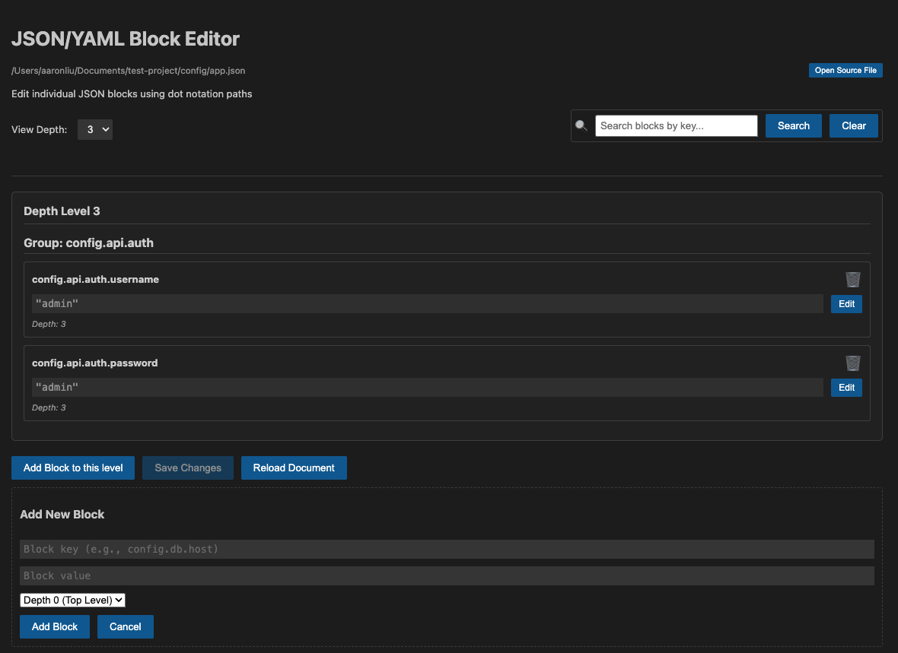

# VS File Manager

Advanced structured file editor with file synchronization capabilities for Visual Studio Code.

Easily edit complex JSON, YAML, XML, and TOML files using a hierarchical block editor, synchronize changes across multiple files, and perform batch updates efficiently.

## Features

- **Block Editor**: Edit structured files in a hierarchical block view using dot notation (e.g., `config.db.host`)
- **File Synchronization**: Automatically detect and synchronize changes across multiple files with same name in your project
- **Batch Updates**: Apply the same changes to multiple structured files simultaneously
- **Multi-format Support**: Works seamlessly with JSON, YAML, XML, and TOML file formats
- **Smart Detection**: Automatic detection of same-named files with configurable sync prompts
- **Extensible Architecture**: Easily extendable to support additional structured file formats

## Structured Block Editor

The Block Editor provides a user-friendly interface for editing structured files with a hierarchical view:

Key features of the Block Editor:
- View file contents organized by depth levels
- Edit values in place with type preservation
- Add new blocks at any depth level
- Delete unwanted blocks
- Search functionality to find specific keys
- Save or reload the document as needed

## Installation

### From VS Code Marketplace
1. Search for "VS File Manager" in the Extensions view (`Ctrl+Shift+X` or `Cmd+Shift+X`)
2. Click Install

### From VSIX (Manual Installation)
1. Download the `.vsix` file from the [latest release](https://github.com/aaronpliu/vsfilemanager/releases)
2. In VS Code, open the Extensions view (`Ctrl+Shift+X` or `Cmd+Shift+X`)
3. Click the "..." menu in the top right
4. Select "Install from VSIX..."
5. Choose the downloaded `.vsix` file

## Commands

- `Edit Structured Blocks`: Open the block editor with a custom webview UI for structured files
- `Sync Files`: Manually trigger file synchronization for structured files
- `Batch Update Structured Files`: Apply the same changes to multiple selected structured files

## Usage

### Editing Structured Blocks

1. Open a JSON, YAML, XML, or TOML file
2. Use the Command Palette (Ctrl+Shift+P or Cmd+Shift+P) to run "Edit Structured Blocks"
3. Modify values in the webview editor
4. Click "Save Changes" to apply modifications
5. Optionally, apply changes to other files using the batch update feature

## Extension Settings

This extension contributes the following settings:

* `vsfilemanager.enable`: Enable/disable this extension
* `vsfilemanager.syncPrompt`: Enable/disable automatic sync prompts

## Release Notes

### 1.3.3
Latest improvements and fixes:
- Fixed object deletion functionality in webview for JSON files
- Fixed issue where media assets were not included in VSIX package
- Fixed ESLint error with function declaration in block editor handler
- Enhanced deletion logic to properly handle nested object structures
- Enhanced cancel logic in QuickPick dialog
- Improved VSIX packaging to include all necessary media assets

### 1.3.2
Latest improvements and fixes:
- Added unit tests to improve code coverage
- Fixed webview block refresh issues
- Added save change notification for deletion operations
- Defined timeout configuration for message display
- Enhanced code commit check with Husky and lint

For detailed changelog of all versions, please refer to [CHANGELOG.md](CHANGELOG.md).

